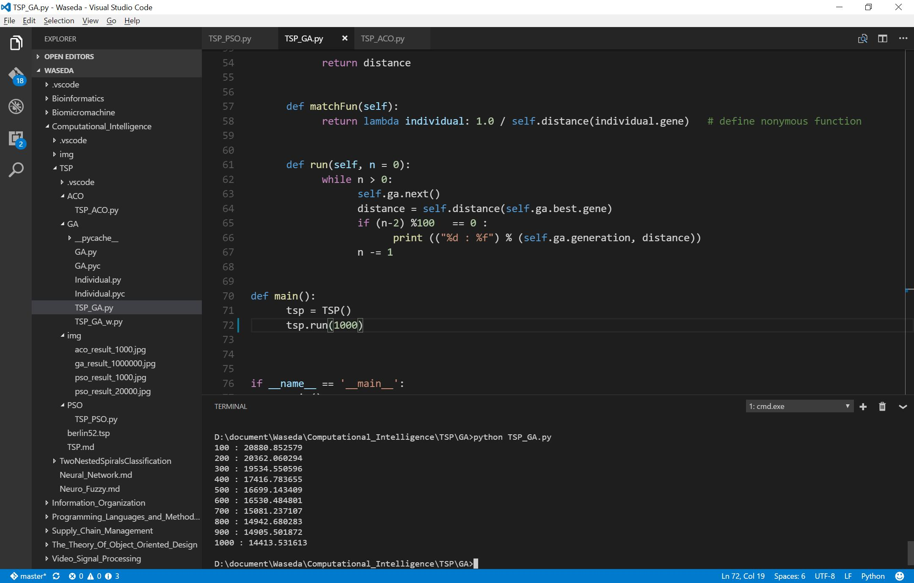
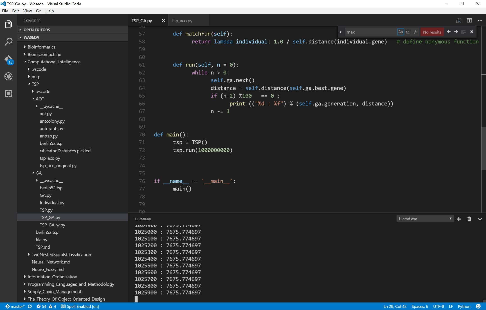
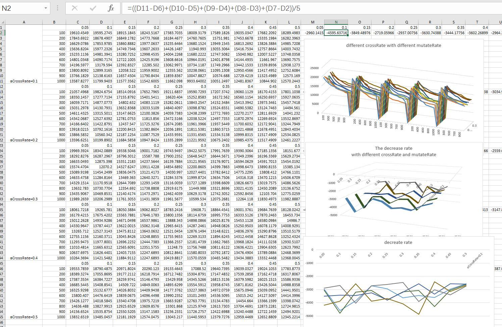
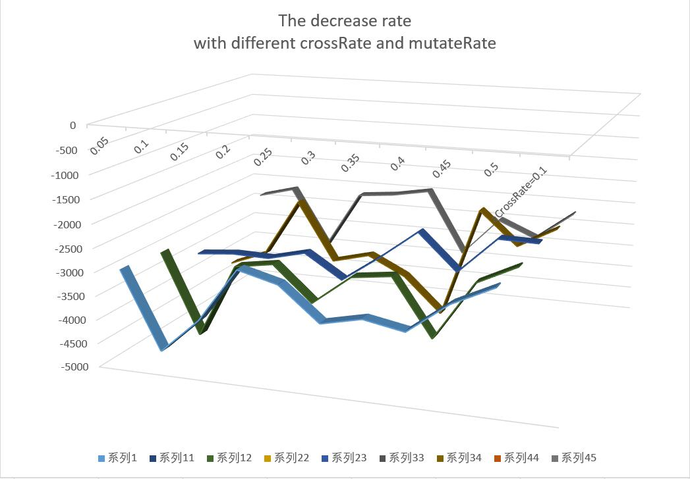
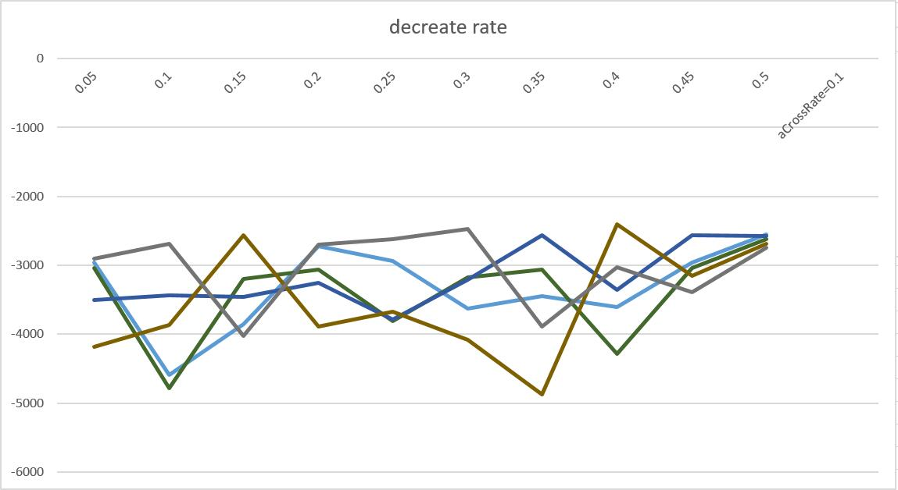
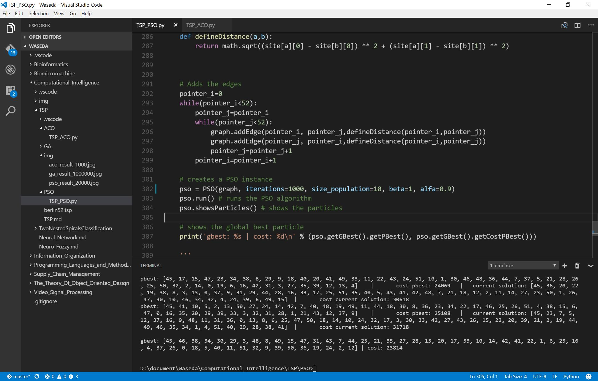

# Final Report of Computation Intelligence

Authored by **SONG DAIWEI** 44161588-3
# Travelling Salesman Problem


Given a list of cities and the distances between each pair of cities, what is the shortest possible route that visits each city exactly once and returns to the origin city?

NP-hard problem in combinatorial optimization

TSP can be regard as a graph problem can can be modelled as an undirected weighted graph:

| Cities               | Paths             | The path's distance |
| -------------------- | ----------------- | ------------------- |
| the graph's vertices | the graph's edges | the edge's weight   |


It is a minimization problem starting and finishing at a specified vertex after having visited each other vertex exactly once. 


Because the distance in Berlin52.tsp is coordinate distance, so it is a symmetric problem.

And I try to improve the algorithms, so I will introduce some improvement in GA and ACO Algorithm.


## GA
Genetic Algorithm (GA) is a metaheuristic inspired by the process of natural selection that belongs to the larger class of evolutionary algorithms (EA). Genetic algorithms are commonly used to generate high-quality solutions to optimization and search problems by relying on bio-inspired operators such as mutation, crossover and selection.

### Flow chart


### Result
1000 iterations


1000000 iterations with the same rate in GA expression.


So we can find that the rate of descent is really slow. especially campared with other algorithms.

### Improvement
In order to know the parameters' efficiency in the expression, especially in the crossRate and mutationRate, I calculate the crossRate from 0-0.5 stepped by 0.1, mutationRate from 0-0.5 stepped by 0.05, iterations times is 10000, and show the temporary result of each 100 iterations.


And the calculate the decreate rate of each state, with considering 10 results, using the method of successive minus.





### Conclusion
So we can find that the parameter in expression of GA, if you want to steepest descent to the final result, maybe you can choose crossRate as 0.4 and mutationRate as 0.35.

## ACO
Ants of some species (initially) wander randomly, and upon finding food return to their colony while laying down pheromone trails. If other ants find such a path, they are likely not to keep travelling at random, but instead to follow the trail, returning and reinforcing it if they eventually find food.

Over time, however, the pheromone trail starts to evaporate, thus reducing its attractive strength. The more time it takes for an ant to travel down the path and back again, the more time the pheromones have to evaporate. A short path, by comparison, gets marched over more frequently, and thus the pheromone density becomes higher on shorter paths than longer ones. Pheromone evaporation also has the advantage of avoiding the convergence to a locally optimal solution. If there were no evaporation at all, the paths chosen by the first ants would tend to be excessively attractive to the following ones. In that case, the exploration of the solution space would be constrained. The influence of pheromone evaporation in real ant systems is unclear, but it is very important in artificial systems.

The overall result is that when one ant finds a good (i.e., short) path from the colony to a food source, other ants are more likely to follow that path, and positive feedback eventually leads to all the ants following a single path. The idea of the ant colony algorithm is to mimic this behavior with "simulated ants" walking around the graph representing the problem to solve.

The probability of ants moving from position i to position j at time t is expressed as follows:

$p^k_{ij} = $


### Pseudo Code

```
  procedure ACO_MetaHeuristic
    while(not_termination)
       generateSolutions()
       daemonActions()
       pheromoneUpdate()
    end while
  end procedure

```


### Improvement

- Use greedy algorithm to initialize the ACO of TSP.

  Greedy algorithm is an algorithmic paradigm that follows the problem solving heuristic of making the locally optimal choice at each stage[1] with the hope of finding a global optimum. In many problems, a greedy strategy does not in general produce an optimal solution, but nonetheless a greedy heuristic may yield locally optimal solutions that approximate a global optimal solution in a reasonable time.
- Rotate the matrix of cities to avoid to fail into the local optimization.


### Result


## PSO

A basic variant of the PSO algorithm works by having a population (called a swarm) of candidate solutions (called particles). These particles are moved around in the search-space according to a few simple formulae. 

The movements of the particles are guided by their own best known position in the search-space as well as the entire swarm's best known position. When improved positions are being discovered these will then come to guide the movements of the swarm. The process is repeated and by doing so it is hoped, but not guaranteed, that a satisfactory solution will eventually be discovered.

Formally, let f: ℝn → ℝ be the cost function which must be minimized. The function takes a candidate solution as argument in the form of a vector of real numbers and produces a real number as output which indicates the objective function value of the given candidate solution. The gradient of f is not known. The goal is to find a solution a for which f(a) ≤ f(b) for all b in the search-space, which would mean a is the global minimum. Maximization can be performed by considering the function h = -f instead.

Let S be the number of particles in the swarm, each having a position xi ∈ ℝn in the search-space and a velocity vi ∈ ℝn. Let pi be the best known position of particle i and let g be the best known position of the entire swarm. A basic PSO algorithm is then:

### Pseudo Code

```
for each particle i = 1, ..., S do
   Initialize the particle's position with a uniformly distributed random vector: xi ~ U(blo, bup)
   Initialize the particle's best known position to its initial position: pi ← xi
   if f(pi) < f(g) then
       update the swarm's best known  position: g ← pi
   Initialize the particle's velocity: vi ~ U(-|bup-blo|, |bup-blo|)
while a termination criterion is not met do:
   for each particle i = 1, ..., S do
      for each dimension d = 1, ..., n do
         Pick random numbers: rp, rg ~ U(0,1)
         Update the particle's velocity: vi,d ← ω vi,d + φp rp (pi,d-xi,d) + φg rg (gd-xi,d)
         Update the particle's position: xi ← xi + vi
         if f(xi) < f(pi) then
            Update the particle's best known position: pi ← xi
            if f(pi) < f(g) then
               Update the swarm's best known position: g ← pi
```

### Result



### Conclusion
We can find that the PSO is the slowest descent to the result, and it cost too much time than others.


# Reference

https://en.wikipedia.org/wiki/Genetic_algorithm

https://en.wikipedia.org/wiki/Ant_colony_optimization_algorithms


https://en.wikipedia.org/wiki/Particle_swarm_optimization


# Appendix - Source Code in TSP
## GA
```python
import random
import math
from numpy  import *
class Individual(object):
      """class of Individual"""
      def __init__(self, aGene = None):
            self.gene = aGene
            self.score = SCORE_NONE

class GA(object):
      """class of GA"""
      def __init__(self, aCrossRate, aMutationRage, aIndividualCount, aGeneLenght, aMatchFun = lambda individual : 1):
            self.crossRate = aCrossRate
            self.mutationRate = aMutationRage
            self.individualCount = aIndividualCount
            self.geneLenght = aGeneLenght
            self.matchFun = aMatchFun                 # adaptation function
            self.population = []                           # population
            self.best = None                          # elitist selection
            self.generation = 1
            self.crossCount = 0
            self.mutationCount = 0
            self.bounds = 0.0                         # sum of adaptation to calculate the probability when selection

            self.initPopulation()


      def initPopulation(self):
            """initial the population"""
            self.population = []
            for i in range(self.individualCount):
                  gene = [ x for x in range(self.geneLenght) ] 
                  random.shuffle(gene)
                  individual = Individual(gene)
                  self.population.append(individual)


      def judge(self):
            """judge to calculate the adaptation of each individual"""
            self.bounds = 0.0
            self.best = self.population[0]
            for individual in self.population:
                  individual.score = self.matchFun(individual)
                  self.bounds += individual.score
                  if self.best.score < individual.score:
                        self.best = individual


      def cross(self, parent1, parent2):
            """cross"""
            index1 = random.randint(0, self.geneLenght - 1)
            index2 = random.randint(index1, self.geneLenght - 1)
            tempGene = parent2.gene[index1:index2]   # cross the pieces of genes
            newGene = []
            p1len = 0
            for g in parent1.gene:
                  if p1len == index1:
                        newGene.extend(tempGene)     # insert the pieces of genes
                        p1len += 1
                  if g not in tempGene:
                        newGene.append(g)
                        p1len += 1
            self.crossCount += 1
            return newGene


      def  mutation(self, gene):
            """mutation of gene"""
            index1 = random.randint(0, self.geneLenght - 1)
            index2 = random.randint(0, self.geneLenght - 1)

            newGene = gene[:]       # generate a new sequence of gene in order not to infect the father population when it mutates # Yvon-Shong 
            newGene[index1], newGene[index2] = newGene[index2], newGene[index1]    # swap
            self.mutationCount += 1
            return newGene


      def getOne(self):
            """select one Individual"""
            r = random.uniform(0, self.bounds)    # generate a real number, the threhold of evolution
            for individual in self.population:
                  r -= individual.score
                  if r <= 0:
                        return individual

            raise Exception("Wrong selection", self.bounds)


      def newChild(self):
            """generate the child"""
            parent1 = self.getOne()
            

            # cross by the probability
            rate1 = random.random()
            if rate1 < self.crossRate:
                  # cross
                  parent2 = self.getOne()
                  gene = self.cross(parent1, parent2)
            else:
                  gene = parent1.gene

            # mutate by the probability
            rate2 = random.random()
            if rate2 < self.mutationRate:
                  gene = self.mutation(gene)

            return Individual(gene)


      def next(self):
            """generate the next generation"""
            self.judge()
            newPopulation = []
            newPopulation.append(self.best)  # elitist selection, choose the best ONE to add to the next generation
            while len(newPopulation) < self.individualCount:
                  newPopulation.append(self.newChild())
            self.population = newPopulation
            self.generation += 1

class TSP(object):
      def __init__(self, aIndividualCount = 100,):
            self.initCitys()
            self.individualCount = aIndividualCount
            self.ga = GA(aCrossRate = 0.7, 
                  aMutationRage = 0.05, 
                  aIndividualCount = self.individualCount, 
                  aGeneLenght = len(self.citys), 
                  aMatchFun = self.matchFun())


      def initCitys(self):
            self.citys = []
            # import the data set of TSP
            a = loadtxt('../berlin52.tsp')  
            self.citys = a[:,1:]
            
      
      
      
      def distance(self, order):
            distance = 0.0
            for i in range(-1, len(self.citys) - 1): # -1 ???
                  index1, index2 = order[i], order[i + 1]
                  city1, city2 = self.citys[index1], self.citys[index2]
                  distance += math.sqrt((city1[0] - city2[0]) ** 2 + (city1[1] - city2[1]) ** 2)
            
            return distance


      def matchFun(self):
            return lambda individual: 1.0 / self.distance(individual.gene)   # define nonymous function


      def run(self, n = 0):
            while n > 0:
                  self.ga.next()
                  distance = self.distance(self.ga.best.gene)
                  if (n-2) %100   == 0 :
                        print (("%d : %f") % (self.ga.generation, distance))
                  n -= 1


def main():
      tsp = TSP()
      tsp.run(1000)
      


if __name__ == '__main__':
      main()

```


## ACO


```python
import random, math
from numpy  import *
import math
# class to present an edge
class Edge:

	def __init__(self, origin, destination, cost):
		self.origin = origin
		self.destination = destination
		self.cost = cost
		self.pheromone = None

	def getOrigin(self):
		return self.origin

	def getDestination(self):
		return self.destination

	def getCost(self):
		return self.cost

	def getPheromone(self):
		return self.pheromone

	def setPheromone(self, pheromone):
		self.pheromone = pheromone


class Graph:

	def __init__(self, num_vertices):
		self.num_vertices = num_vertices # The number of vertices of the graph
		self.edges = {} # The dictionary of the edges
		self.neighbors = {} # The dictionary of all the neighbors of each vertex


	def addEdge(self, origin, destination, cost):
		edge = Edge(origin=origin, destination=destination, cost=cost)
		self.edges[(origin, destination)] = edge
		if origin not in self.neighbors:
			self.neighbors[origin] = [destination]
		else:
			self.neighbors[origin].append(destination)
		
		edge_symmetry = Edge(origin=destination, destination=origin, cost=cost) # add the symmetric path with the same cost
		self.edges[(destination,origin)] = edge_symmetry
		if destination not in self.neighbors:
			self.neighbors[destination] = [origin]
		else:
			self.neighbors[destination].append(origin)
		


	def getCostEdge(self, origin, destination):
		return self.edges[(origin, destination)].getCost()

	def getPheromoneEdge(self, origin, destination):
		return self.edges[(origin, destination)].getPheromone()

	def setPheromoneEdge(self, origin, destination, pheromone):
		self.edges[(origin, destination)].setPheromone(pheromone)

	def getCostPath(self, path):
		cost = 0
		for i in range(self.num_vertices - 1):
			cost += self.getCostEdge(path[i], path[i+1])
		# Add the final cost
		cost += self.getCostEdge(path[-1], path[0])
		return cost


class GraphComplete(Graph):
	# Generates a graph complete
	def generate(self):
		for i in range(0, self.num_vertices):
			for j in range(0, self.num_vertices):
				if i != j:
					peso = random.randint(1, 10)
					self.addEdge(i, j, peso)


class Ant:

	def __init__(self, city):
		self.city = city
		self.solution = []
		self.cost = None

	def getCity(self):
		return self.city

	def setCity(self, city):
		self.city = city

	def getSolution(self):
		return self.solution

	def setSolution(self, solution, cost):
		# update the solution
		if not self.cost:
			self.solution = solution[:]
			self.cost = cost
		else:
			if cost < self.cost:
				self.solution = solution[:]
				self.cost = cost

	def getCostSolution(self):
		return self.cost


class ACO:

	def __init__(self, graph, num_ants, alpha=1.0, beta=5.0, iterations=10, evaporationRate=0.5):
		self.graph = graph
		self.num_ants = num_ants
		self.alpha = alpha # The importance of the pheromone
		self.beta = beta # The importance of the heuristic information
		self.iterations = iterations # The amount of iterations
		self.evaporationRate = evaporationRate # The rate of evaporation
		self.ants = [] # The list of ants

		list_citys = [city for city in range(0, self.graph.num_vertices)]
		# Creates the ants by putting each one in a city.
		for k in range(self.num_ants):
			city_ant = random.choice(list_citys)
			list_citys.remove(city_ant)
			self.ants.append(Ant(city=city_ant))
			if not list_citys:
				list_citys = [city for city in range(0, self.graph.num_vertices)]


		# Calculates the greedy cost to use in the pheromone initialization
		cost_greedy = 0.0 # cost greedy
		vertice_initial = random.randint(0, graph.num_vertices-1) # Selects a random vertex
		vertice_current = vertice_initial
		visited = [vertice_current] # The list of visited
		while True:
			neighbors = self.graph.neighbors[vertice_current][:]
			costs, option = [], {}
			for neighbor in neighbors:
				if neighbor not in visited:
					cost = self.graph.getCostEdge(vertice_current, neighbor)
					option[cost] = neighbor
					costs.append(cost)
			if len(visited) == self.graph.num_vertices:
				break
			min_cost = min(costs) # Get the lowest cost list.
			cost_greedy += min_cost # Add the cost to the total
			vertice_current = option[min_cost] # Updates the current vertex
			visited.append(vertice_current) # Marks the current as a visited vertex

		# Add the cost of the last visited of the cost_ greedy
		cost_greedy += self.graph.getCostEdge(visited[-1], vertice_initial)

		# Initializes the pheromone of all edges
		for key_edge in self.graph.edges:
			pheromone = 1.0 / (self.graph.num_vertices * cost_greedy)
			self.graph.setPheromoneEdge(key_edge[0], key_edge[1], pheromone)


	def rotate(self):

		for it in range(self.iterations):

			# List of lists of the city 's visited by each ant.
			citys_visited = []
			for k in range(self.num_ants):
				# Add the city of origin of each ant.
				citys = [self.ants[k].getCity()]
				citys_visited.append(citys)

			# For each ant builds a solution.
			for k in range(self.num_ants):
				for i in range(0, self.graph.num_vertices-1):
					# Get all the neighbors that have not been visited
					citys_not_visited = list(set(self.graph.neighbors[self.ants[k].getCity()]) - set(citys_visited[k]))
					
					# The sum of the number of city 's not visited by ant "k"
					# Will be used in the calculation of the likelihood
					somatorio = 0.0
					for city in citys_not_visited:
						# Calculates the pheromone
						pheromone =  self.graph.getPheromoneEdge(self.ants[k].getCity(), city)
						# Obtains the distance
						distance = self.graph.getCostEdge(self.ants[k].getCity(), city)
						# Add in the sum
						somatorio += (math.pow(pheromone, self.alpha) * math.pow(1.0 / distance, self.beta))

					# probabilities f choosing a path
					probabilities = {}

					for city in citys_not_visited:
						# Calculates the pheromone
						pheromone = self.graph.getPheromoneEdge(self.ants[k].getCity(), city)
						# Obtains the distance
						distance = self.graph.getCostEdge(self.ants[k].getCity(), city)
						#  Obtains the probability
						probability = (math.pow(pheromone, self.alpha) * math.pow(1.0 / distance, self.beta)) / (somatorio if somatorio > 0 else 1)
						# Add to the list of probabilities
						probabilities[city] = probability
						# print(probabilities)

					# Obtains the chosen city 
					city_chosen = max(probabilities, key=probabilities.get) 

					# Adds the chosen city to the list of citys visited by ant "K"
					citys_visited[k].append(city_chosen)

				# Updates the solution found by the ant.
				self.ants[k].setSolution(citys_visited[k], self.graph.getCostPath(citys_visited[k]))

			# updates the amount of pheromone 
			for edge in self.graph.edges:
				# The sum of the pheromones of the edge
				somatorio_pheromone = 0.0
				# For each ant "K"
				for k in range(self.num_ants):
					edges_ant = []
					# It generates all the edges travelled by the ant "K"
					for j in range(self.graph.num_vertices - 1):#changed
						edges_ant.append((citys_visited[k][j], citys_visited[k][j+1]))
					# Add the last edge
					edges_ant.append((citys_visited[k][-1], citys_visited[k][0]))
					# Check whether the edge is part of the path of the ant "K"
					if edge in edges_ant:
						somatorio_pheromone += (1.0 / self.graph.getCostPath(citys_visited[k]))
				# Calculates the new pheromone
				novo_pheromone = (1.0 - self.evaporationRate) * self.graph.getPheromoneEdge(edge[0], edge[1]) + somatorio_pheromone
				# The arrow of the new pheromone edge
				self.graph.setPheromoneEdge(edge[0], edge[1], novo_pheromone)


		# Through to get the solutions of the ants
		solution, cost = None, None
		for k in range(self.num_ants):
			if not solution:
				solution = self.ants[k].getSolution()[:]
				cost = self.ants[k].getCostSolution()
			else:
				aux_cost = self.ants[k].getCostSolution()
				if aux_cost < cost:
					solution = self.ants[k].getSolution()[:]
					cost = aux_cost
		print('solution final: %s | cost: %d\n' % (' -> '.join(str(i) for i in solution), cost))


if __name__ == "__main__":
	#song daiwei
	# Creates a graph and the number of vertices
	graph = Graph(num_vertices = 52)


	berlin52 = loadtxt('../berlin52.tsp')  
	site={}
	count_0=0
	while(count_0<52):
		site[str(int(count_0))]=[berlin52[count_0][1],berlin52[count_0][2]]
		count_0=count_0+1

	d={}
	count_1=0
	while(count_1<52):
		d[str(int(count_1))]=count_1
		count_1=count_1+1

	def defineDistance(a,b):
		return math.sqrt((site[a][0] - site[b][0]) ** 2 + (site[a][1] - site[b][1]) ** 2)

		

	# Adds the edges
	pointer_i=0
	while(pointer_i<52):
		pointer_j=pointer_i
		while(pointer_j<52):
			graph.addEdge(d[str(int(pointer_i))], d[str(int(pointer_j))],defineDistance(str(int(pointer_i)),str(int(pointer_j))))
			pointer_j=pointer_j+1
		pointer_i=pointer_i+1


	# Creates an instance of the ACO
	
	aco = ACO(graph=graph, num_ants=graph.num_vertices, alpha=1.0, beta=5.0, iterations=1000, evaporationRate=0.5)
	# rotate the algorithm
	aco.rotate()


```

## PSO

```python

# class that represents a graph
class Graph:

	def __init__(self, amount_vertices):
		self.edges = {} # dictionary of edges
		self.vertices = set() # set of vertices
		self.amount_vertices = amount_vertices # amount of vertices


	# adds a edge linking "src" in "dest" with a "cost"
	def addEdge(self, src, dest, cost = 0):
		# checks if the edge already exists
		if not self.existsEdge(src, dest):
			self.edges[(src, dest)] = cost
			self.vertices.add(src)
			self.vertices.add(dest)


	# checks if exists a edge linking "src" in "dest"
	def existsEdge(self, src, dest):
		return (True if (src, dest) in self.edges else False)


	# shows all the links of the graph
	def showGraph(self):
		print('Showing the graph:\n')
		for edge in self.edges:
			print('%d linked in %d with cost %d' % (edge[0], edge[1], self.edges[edge]))

	# returns total cost of the path
	def getCostPath(self, path):
		
		total_cost = 0
		for i in range(self.amount_vertices - 1):
			total_cost += self.edges[(path[i], path[i+1])]

		# add cost of the last edge
		total_cost += self.edges[(path[self.amount_vertices - 1], path[0])]
		return total_cost


	# gets random unique paths - returns a list of lists of paths
	def getRandomPaths(self, max_size):

		random_paths, list_vertices = [], list(self.vertices)

		initial_vertice = random.choice(list_vertices)
		if initial_vertice not in list_vertices:
			print('Error: initial vertice %d not exists!' % initial_vertice)
			sys.exit(1)

		list_vertices.remove(initial_vertice)
		list_vertices.insert(0, initial_vertice)

		for i in range(max_size):
			list_temp = list_vertices[1:]
			random.shuffle(list_temp)
			list_temp.insert(0, initial_vertice)

			if list_temp not in random_paths:
				random_paths.append(list_temp)

		return random_paths


# class that represents a complete graph
class CompleteGraph(Graph):

	# generates a complete graph
	def generates(self):
		for i in range(self.amount_vertices):
			for j in range(self.amount_vertices):
				if i != j:
					weight = random.randint(1, 10)
					self.addEdge(i, j, weight)


# class that represents a particle
class Particle:

	def __init__(self, solution, cost):

		# current solution
		self.solution = solution

		# best solution (fitness) it has achieved so far
		self.pbest = solution

		# set costs
		self.cost_current_solution = cost
		self.cost_pbest_solution = cost

		# velocity of a particle is a sequence of 4-tuple
		# (1, 2, 1, 'beta') means SO(1,2), prabability 1 and compares with "beta"
		self.velocity = []

	# set pbest
	def setPBest(self, new_pbest):
		self.pbest = new_pbest

	# returns the pbest
	def getPBest(self):
		return self.pbest

	# set the new velocity (sequence of swap operators)
	def setVelocity(self, new_velocity):
		self.velocity = new_velocity

	# returns the velocity (sequence of swap operators)
	def getVelocity(self):
		return self.velocity

	# set solution
	def setCurrentSolution(self, solution):
		self.solution = solution

	# gets solution
	def getCurrentSolution(self):
		return self.solution

	# set cost pbest solution
	def setCostPBest(self, cost):
		self.cost_pbest_solution = cost

	# gets cost pbest solution
	def getCostPBest(self):
		return self.cost_pbest_solution

	# set cost current solution
	def setCostCurrentSolution(self, cost):
		self.cost_current_solution = cost

	# gets cost current solution
	def getCostCurrentSolution(self):
		return self.cost_current_solution

	# removes all elements of the list velocity
	def clearVelocity(self):
		del self.velocity[:]


# PSO algorithm
class PSO:

	def __init__(self, graph, iterations, size_population, beta=1, alfa=1):
		self.graph = graph # the graph
		self.iterations = iterations # max of iterations
		self.size_population = size_population # size population
		self.particles = [] # list of particles
		self.beta = beta # the probability that all swap operators in swap sequence (gbest - x(t-1))
		self.alfa = alfa # the probability that all swap operators in swap sequence (pbest - x(t-1))

		# initialized with a group of random particles (solutions)
		solutions = self.graph.getRandomPaths(self.size_population)

		# checks if exists any solution
		if not solutions:
			print('Initial population empty! Try run the algorithm again...')
			sys.exit(1)

		# creates the particles and initialization of swap sequences in all the particles
		for solution in solutions:
			# creates a new particle
			particle = Particle(solution=solution, cost=graph.getCostPath(solution))
			# add the particle
			self.particles.append(particle)

		# updates "size_population"
		self.size_population = len(self.particles)


	# set gbest (best particle of the population)
	def setGBest(self, new_gbest):
		self.gbest = new_gbest

	# returns gbest (best particle of the population)
	def getGBest(self):
		return self.gbest


	# shows the info of the particles
	def showsParticles(self):

		print('Showing particles...\n')
		for particle in self.particles:
			print('pbest: %s\t|\tcost pbest: %d\t|\tcurrent solution: %s\t|\tcost current solution: %d' \
				% (str(particle.getPBest()), particle.getCostPBest(), str(particle.getCurrentSolution()),
							particle.getCostCurrentSolution()))
		print('')


	def run(self):

		# for each time step (iteration)
		for t in range(self.iterations):

			# updates gbest (best particle of the population)
			self.gbest = min(self.particles, key=attrgetter('cost_pbest_solution'))

			# for each particle in the swarm
			for particle in self.particles:

				particle.clearVelocity() # cleans the speed of the particle
				temp_velocity = []
				solution_gbest = self.gbest.getPBest() # gets solution of the gbest
				solution_pbest = particle.getPBest()[:] # copy of the pbest solution
				solution_particle = particle.getCurrentSolution()[:] # gets copy of the current solution of the particle

				# generates all swap operators to calculate (pbest - x(t-1))
				for i in range(self.graph.amount_vertices):
					if solution_particle[i] != solution_pbest[i]:
						# generates swap operator
						swap_operator = (i, solution_pbest.index(solution_particle[i]), self.alfa)

						# append swap operator in the list of velocity
						temp_velocity.append(swap_operator)

						# makes the swap
						aux = solution_pbest[swap_operator[0]]
						solution_pbest[swap_operator[0]] = solution_pbest[swap_operator[1]]
						solution_pbest[swap_operator[1]] = aux

				# generates all swap operators to calculate (gbest - x(t-1))
				for i in range(self.graph.amount_vertices):
					if solution_particle[i] != solution_gbest[i]:
						# generates swap operator
						swap_operator = (i, solution_gbest.index(solution_particle[i]), self.beta)

						# append swap operator in the list of velocity
						temp_velocity.append(swap_operator)

						# makes the swap
						aux = solution_gbest[swap_operator[0]]
						solution_gbest[swap_operator[0]] = solution_gbest[swap_operator[1]]
						solution_gbest[swap_operator[1]] = aux

				
				# updates velocity
				particle.setVelocity(temp_velocity)

				# generates new solution for particle
				for swap_operator in temp_velocity:
					if random.random() <= swap_operator[2]:
						# makes the swap
						aux = solution_particle[swap_operator[0]]
						solution_particle[swap_operator[0]] = solution_particle[swap_operator[1]]
						solution_particle[swap_operator[1]] = aux
				
				# updates the current solution
				particle.setCurrentSolution(solution_particle)
				# gets cost of the current solution
				cost_current_solution = self.graph.getCostPath(solution_particle)
				# updates the cost of the current solution
				particle.setCostCurrentSolution(cost_current_solution)

				# checks if current solution is pbest solution
				if cost_current_solution < particle.getCostPBest():
					particle.setPBest(solution_particle)
					particle.setCostPBest(cost_current_solution)
		

if __name__ == "__main__":
	#song daiwei
	# creates the Graph instance

	graph = Graph(amount_vertices=52)

	# This graph is in the folder "images" of the repository.
	
	berlin52 = loadtxt('../berlin52.tsp')  
	site=berlin52[:,1:]


	def defineDistance(a,b):
		return math.sqrt((site[a][0] - site[b][0]) ** 2 + (site[a][1] - site[b][1]) ** 2)

		

	# Adds the edges
	pointer_i=0
	while(pointer_i<52):
		pointer_j=pointer_i
		while(pointer_j<52):
			graph.addEdge(pointer_i, pointer_j,defineDistance(pointer_i,pointer_j))
			graph.addEdge(pointer_j, pointer_i,defineDistance(pointer_i,pointer_j))
			pointer_j=pointer_j+1
		pointer_i=pointer_i+1
	
	# creates a PSO instance
	pso = PSO(graph, iterations=1000, size_population=10, beta=1, alfa=0.9)
	pso.run() # runs the PSO algorithm
	pso.showsParticles() # shows the particles

	# shows the global best particle
	print('gbest: %s | cost: %d\n' % (pso.getGBest().getPBest(), pso.getGBest().getCostPBest()))


```